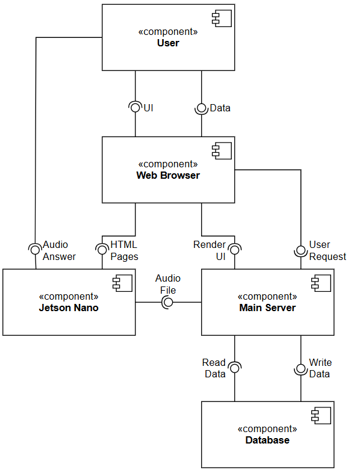

# Веб-приложение, применяемое в лабораторном роботе-андроиде для конвертации речи в текст и текста в речь с использованием языковой модели

Данный проект реализует два взаимодействующих между собой сервера. Главный сервер предназначен для задач, требующих значительных вычислительных мощностей. Он взаимодействует с базой данной о осуществляет преобразование информации. Второстепенный сервер возвращает страницы HTML и может быть запущен на крайне слабых устройствах (например, Jetson Nano).

> [!CAUTION]
> Предполагается, что на главном сервере утсановлен RHVoive для синтеза речи. Также необходимо наличие папки lm_models, содержащей следующие языковые модели: SmallDoge, Whisper, Helsinki-ru-en, Helsinki-en-ru.

> [!TIP]
> Если оба сервера работают на одном компьютере, их проще всего запускать на 127.0.0.1. Для этого необходимо указать этот IP-адрес в файле .env и при запуске серверов из командной строки.

## Оглавление
- **[Диаграмма компонентов](#диаграмма-компонентов)**
- **[Инструкция по запуску](#инструкция-по-запуску)**
- **[Технологический стек](#технологический-стек)**
- **[Страницы](#страницы)**

## Диаграмма компонентов



## Инструкция по запуску

1. Клонирование репозитория:

    ```
    git clone https://github.com/Kirill-Erofeev/diploma.git
    ```

2. Переход в корневую папку проекта:

    ```
    cd diploma
    ```

3. Создание виртуального окружения:

    ```
    python -m venv venv
    ```

4. Активация виртуального окружения  
    4.1. Для Windows:

    ```powershell
    venv\Scripts\activate.bat
    ```

    4.2 Для Linux:

    ```bash
    source venv/bin/activate
    ```

5. Установка зависимостей  
    5.1. Для главного сервера:

    ```
    pip install -r backend_requirements.txt
    ```

    5.2. Для второстепенного сервера:

    ```
    pip install -r frontend_requirements.txt
    ```

6. Настройка программы  
    6.1. Для Windows:
    ```powershell
    ipconfig
    ```

    6.2. Для Linux:

    ```bash
    ifconfig
    ```

    6.3 Выбор IP-адресов, находящихся в одной подсети, и их последующее внесение в .env и backend/main.py;

7. Запуск  
    7.1. Главного сервера:

    ```
    uvicorn backend.main:app --host=0.0.0.0 --port=8001 --ssl-keyfile=./certs/unified_key.key --ssl-certfile=./certs/unified_cert.crt --reload
    ```

    7.2. Второстепенного сервера:

    ```
    uvicorn frontend.main:app --host=0.0.0.0 --port=8000 --ssl-keyfile=./certs/unified_key.key --ssl-certfile=./certs/unified_cert.crt --reload
    ```

8. Работа в браузере

    > [!CAUTION]
    > Для упрощённого запуска программы необходимо открыть браузер в режиме игнорирования сертификатов. Это может нанести вред компьютеру, поэтому необходимо работать только с этим веб-приложением.

    8.1. Запуск браузера с игнорированием сертификатов на Windows:

    ```powershell
    start chrome --ignore-certificate-errors
    ```

    8.2. Запуск браузера с игнорированием сертификатов на Linux:

    ```bash
    chromium-browser --ignore-certificate-errors
    ```

    8.3. Вставка `https://0.0.0.0:8000` в адресную строку;  
    8.4. Работа с веб-приложением;

9. Запуск приложения в полноценном режиме (работа с самоподписанными сертификатами)  
    9.1. Добавить IP-адреса компьютеров в certs/san.cnf;  
    9.2. Сгенерировать самоподписанный ключ и сертификат в папке certs:

    ```
    openssl req -x509 -nodes -days 365 -newkey rsa:2048 -keyout unified_key.key -out unified_cert.crt -config san.cnf -extensions v3_req
    ```

    9.3. Скопировать полученные файлы на другой сервер;  
    9.4. Добавить самоподписанный сертификат в список доверенных.

## Технологический стек

| Компонент                    | Технология    |
| :-                           | :-            |
| Backend                      | FastAPI, REST |
| Database                     | SQLite        |
| Object-Relational Mapping    | SQLAlchemy    |
| Automatic Speech Recognition | Whisper       |
| Text Translation             | Helsinki-NLP  |
| Text Generation              | SmallDoge     |
| Speech Synthesis             | RHVoice       |
| Authentication               | JWT, OAuth2   |
| Frontend                     | HTML, CSS, JS |
| Start                        | Uvicorn       |
| Containerization             | Docker        |
| Version Control System       | Git, GitHub   |
| Security                     | OpenSSL       |

## Страницы

Страница входа и регистрации  

Главная страница  

Страница истории  
